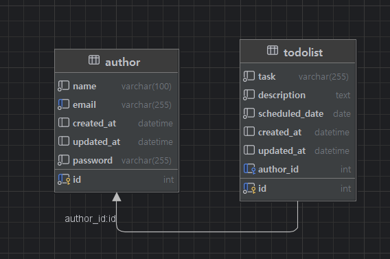

# Todolist

This project is to study how to use Spring Boot. Many people can save their info and Todolist with their email and password. 

## Table of Contents

1. [API Specification](#api-specification)
2. [Entity Relationship Diagram (ERD)](#entity-relationship-diagram-erd)
3. [SQL Schema](#sql-schema)
4. [Feature Implementation](#feature-implementation)
    - [Create Todolist](#create-Todolist)
    - [Retrieve All Todolists](#retrieve-all-Todolists)
    - [Retrieve All Todolists with Paging](#retrieve-all-Todolists-with-Paging)
    - [Retrieve Specific Todolist by `id` of  `todolist` Table](#retrieve-specific-todolist-by-id-of-todolist-table)
    - [Retrieve Specific Todolist by `id` of  `authro` Table](#retrieve-specific-todolist-by-id-of-author-table)
    - [Update Todolist](#update-Todolist)
    - [Delete Todolist](#delete-Todolist)
5. [Advanced Features](#advanced-features)
    - [User and Todolist Relationship](#user-and-schedule-relationship)
    - [Pagination](#pagination)
    - [Exception Handling](#exception-handling)
    - [Validation](#validation)
6. [Developer](#Developer)

---

## API Specification


| API Name                            | Method | URL                  | Request Params | Request Body                                                                                   | Response                                                                                                                                                      | Status Code                                      |
|-------------------------------------|--------|----------------------|----------------|------------------------------------------------------------------------------------------------|---------------------------------------------------------------------------------------------------------------------------------------------------------------|-------------------------------------------------|
| Save Todolist                       | POST   | /todo                | none           | `{"task": "Task content", "description": "description of the task","author": "Author name", "password": "Password", "scheduled_date": "Scheduled date"}` | `{"id": "Unique identifier", "task": "Task content", "description": "description of the task", "author": "Author name", "scheduled_date": "Scheduled date", "created_at": "Creation date", "updated_at": "Modification date"}` | 200: OK<br>400: Bad Request                     |
| View All Todolists                  | GET    | /todo                | none           | none                                                                                           | `[ { "id": "Unique identifier", "task": "Task content", "description": "description of the task", "author": "Author name", "scheduled_date": "Scheduled date", "created_at": "Creation date", "updated_at": "Modification date" }, ... ]` | 200: OK<br>400: Bad Request                     |
| View All Todolists by Page          | GET    | /todo                | page, size     | none                                                                                           | `[ { "id": "Unique identifier", "task": "Task content", "description": "description of the task", "author": "Author name", "scheduled_date": "Scheduled date", "created_at": "Creation date", "updated_at": "Modification date" }, ... ]` | 200: OK<br>400: Bad Request                     |
| View Selected Day's Todolist        | GET    | /todo/scheduled_date | scheduled_date | `{"scheduled_date": "Scheduled date"}`                                                       | `[ { "id": "Unique identifier", "task": "Task content", "description": "description of the task", "author": "Author name", "scheduled_date": "Scheduled date", "created_at": "Creation date", "updated_at": "Modification date" }, ... ]` | 200: OK<br>400: Bad Request                     |
| View Selected Todolist by Id        | GET    | /todo/{id}           | none           | `{"id": "Unique identifier"}`                                                                | `{"id": "Unique identifier", "task": "Task content", "author": "Author name", "scheduled_date": "Scheduled date", "created_at": "Creation date", "updated_at": "Modification date"}` | 200: OK<br>404: Not Found                        |
| View Selected Todolist by Author Id | GET    | /todo/user           | id(author)     | `{"id": "Unique identifier"}`                                                                | `{"id": "Unique identifier", "task": "Task content", "author": "Author name", "scheduled_date": "Scheduled date", "created_at": "Creation date", "updated_at": "Modification date"}` | 200: OK<br>404: Not Found                        |
| Edit Selected Todolist              | PUT    | /todo/{id}           | none           | `{"id": "Unique identifier", "task": "Updated task content", "description": "description of the task", "author": "Updated author name", "password": "Password"}` | `{"id": "Unique identifier", "task": "Updated task content", "description": "description of the task", "author": "Updated author name", "scheduled_date": "Scheduled date", "created_at": "Creation date", "updated_at": "Modification date"}` | 200: OK<br>400: Bad Request<br>401: Unauthorized<br>404: Not Found |
| Delete Selected Todolist            | DELETE | /todo/{id}           | none           | `{"id": "Unique identifier", "password": "Password"}`                                       | None                                                                                                                                                          | 200: OK<br>401: Unauthorized<br>404: Not Found  |


## Entity Relationship Diagram (ERD)



## SQL Schema

```sql
CREATE TABLE author (
    id INT AUTO_INCREMENT PRIMARY KEY,
    name VARCHAR(100) NOT NULL,
    email VARCHAR(255) UNIQUE NOT NULL,
    password VARCHAR(255) NOT NULL, 
    created_at TIMESTAMP DEFAULT CURRENT_TIMESTAMP,
    updated_at TIMESTAMP DEFAULT CURRENT_TIMESTAMP ON UPDATE CURRENT_TIMESTAMP,
    UNIQUE(name, password) -- prevent the duplication

);

CREATE TABLE schedules (
    id INT AUTO_INCREMENT PRIMARY KEY,
    task VARCHAR(200) NOT NULL,
    author_id INT,
    created_at TIMESTAMP DEFAULT CURRENT_TIMESTAMP,
    updated_at TIMESTAMP DEFAULT CURRENT_TIMESTAMP ON UPDATE CURRENT_TIMESTAMP,
    FOREIGN KEY (user_id) REFERENCES users(id)
);
```

## Feature Implementation

### Create Todolist
- Stores `task`, `author name`, `password`, and timestamps.
- `created_at` and `updated_at` are set automatically.
- If author who posts is the new author, the author is newly added on the author table.
- `created_at` and `updated_at` of the author table are set automatically, too.

### Retrieve All Todolists
- Retrieve all saved schedules.

### Retrieve All Todolists with Paging
- Retrieve all saved schedules with (`page number`, `page size`).

### Retrieve Specific Todolist by `id` of `todolist` Table
- Fetch a schedule by its unique `ID` of `todolist` table.

### Retrieve Specific Todolist by `id` of `author` Table
- Fetch a schedule by its unique `ID` of `author` table.

### Update Todolist
- `task`, `scheduled_name`, `author name` can be updated.
- Requires `email` and `password` verification.
- `updated_at` changes to the modification time.

### Delete Todolist
- Requires `email` and `password` verification to delete a schedule.

## Advanced Features

### Author and Todolist Relationship
- Implemented `author` table to separate author details.
- Users have unique identifiers (IDs), and schedules reference them via `id` of `author`.
- Modified query logic to search schedules by `id` of `author`.

### Pagination
- Uses query parameters (`page number`, `page size`) to retrieve schedules.
- If an invalid page is requested, returns an empty list.

### Exception Handling
- Returns proper HTTP status codes and error messages.
- Custom exceptions for unauthorized access (incorrect password) and invalid queries.

### Validation
- `task`: Maximum length of 200 characters, required.
- `description`: Required.
- `name`: Required.
- `email`: Must follow standard email format, required.
- `password`: Required.
- `scheduled_date`: Required.


---

## Developer
- Developer: Kibeom Park
- Email: kibeom0806@gmail.com